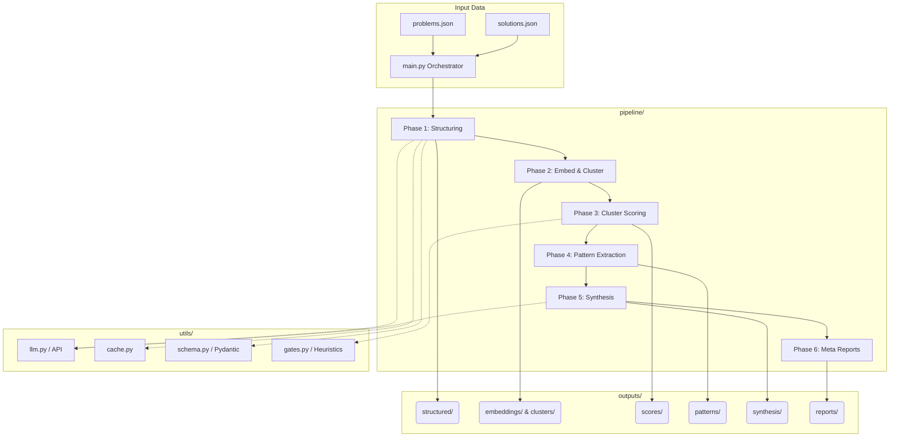

# 🏗️ Solution Intelligence System Architecture

## 1. System Overview
The **Solution Intelligence** system is an advanced data processing and analytics pipeline designed to ingest unstructured solution proposals (e.g., from hackathons or vendor bids), semantically analyze them against specific problem statements, and synthesize optimal, high-quality meta-solutions. 

The architecture is built on a sequential 6-phase pipeline utilizing Large Language Models (LLMs) for semantic understanding and Natural Language Processing (NLP) techniques for vector embeddings and clustering.

---

## 2. High-Level Architecture Diagram

---

## 3. Pipeline Phases in Detail

### Phase 1: Structuring Data (`phase1_structure.py`)
* **Role:** Normalizes massive amounts of unstructured raw text (solution descriptions) into unified schema models.
* **Mechanism:** Uses LLMs (via `utils/llm.py`) enforced by Pydantic models (`utils/schema.py`) to extract key constraints, technical stacks, and approaches.
* **Persistence:** Results are cached to prevent redundant, expensive LLM API calls using `utils/cache.py`.

### Phase 2: Embedding & Clustering (`phase2_embed_cluster.py`)
* **Role:** Transforms the structured text into high-dimensional vector space to group similar solutions.
* **Mechanism:** 
  * Generates vectors using **SentenceTransformers** (e.g., `all-MiniLM-L6-v2`).
  * Stores embeddings efficiently utilizing **FAISS**.
  * Segments vectors into semantic groupings (clusters) using density-based algorithms (like DBSCAN/scikit-learn).

### Phase 3: Cluster Scoring (`phase3_score.py`)
* **Role:** Assesses the analytical quality and relevance of each synthesized cluster.
* **Mechanism:** Implements heuristic quality gates (`utils/gates.py`) to label clusters as `ELITE`, `STRONG`, or `BASELINE` depending on density, context richness, and overlap with the base problem statement.

### Phase 4: Pattern Extraction (`phase4_patterns.py`)
* **Role:** Identifies dominant technological trends, missing links, and direct contradictions.
* **Mechanism:** Analyzes the differential values between clusters. For example, finding if Cluster A uses Webhooks while Cluster B relies heavily on API Polling, highlighting trade-offs.

### Phase 5: Synthesis (`phase5_synthesis.py`)
* **Role:** Merges the best ideas across solutions.
* **Mechanism:** Cross-pollinates features from `ELITE` and `STRONG` clusters to ask the LLM to output what the ultimate "Master Solution" architecture would look like, essentially combining the smartest aspects of the top submissions.

### Phase 6: Meta Reports (`phase6_meta.py`)
* **Role:** Produces human-readable intelligence deliverables.
* **Mechanism:** Aggregates findings from phases 1-5 to construct markdown or JSON reporting deliverables customized for stakeholders answering the core problem statements (such as Hackathon judges or Procurement Officers).

---

## 4. Sub-system Modules (`utils/`)
* **`llm.py`**: A resilient wrapper managing rate limits, timeouts, and JSON parsing for external LLM ingestion.
* **`schema.py`**: Ensures strictly typed input and output contracts across phases, primarily leveraging Pydantic.
* **`cache.py`**: A local hash-based storage system that ensures pipeline idempotency (re-running the pipeline won't re-trigger successful LLM endpoints).
* **`gates.py`**: Configurable boolean/scoring logic to determine if data quality is high enough to pass to the next phase.

---

## 5. Technology Stack
* **Python 3+**: Core runtime environment.
* **Sentence-Transformers & FAISS**: NLP Embeddings and blazing-fast vector similarity search.
* **Scikit-Learn**: Analytical clustering.
* **Pydantic**: Robust data validation and settings management.
* **Pytest**: Used for CI/CD smoke testing (`tests/test_pipeline_smoke.py`).