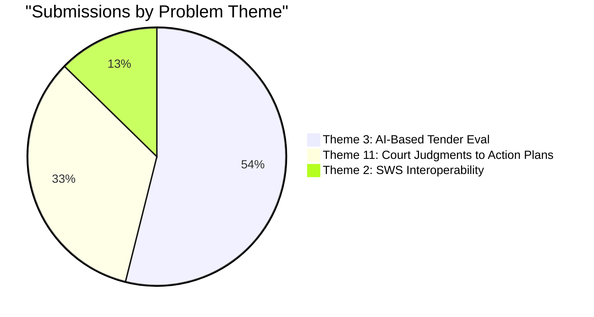
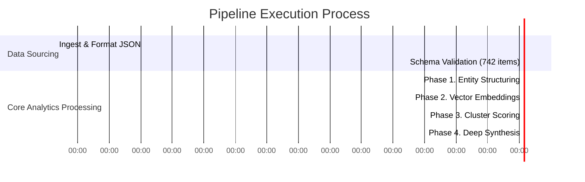

# 📊 Comprehensive Solution Intelligence Analysis Report

## Executive Summary
This report analyzes 742 submissions mapped across 3 major Hackathon problem statements. The objective of this phase is to structure unstructured raw descriptions, identify top analytical patterns using semantic embeddings, and classify winning trends.

---

## 📈 1. Dataset Scale & Distribution 

### Total Submissions: 742

Below is the distribution of submissions across the 3 primary themes:

* **Theme 2 (Two-Way Interoperability between SWS & Dept Systems):** 94 submissions (12.7%)
* **Theme 3 (AI-Based Tender Evaluation for Govt Procurement):** 400 submissions (53.9%) 
* **Theme 11 (From Court Judgments to Verified Action Plans):** 248 submissions (33.4%)

---

## 🧠 2. Deep Dive by Theme

### Theme 2: Interoperability (Karnataka Commerce & Industry)
* **Goal:** Design a robust, two-way sync layer between SWS and legacy systems.
* **Volume:** 94 Proposals
* **Key Challenges Being Analyzed (Pipeline Phase 1):** 
  * Schema translations between multiple differing APIs.
  * Webhook/polling architectures for legacy endpoints.
  * Audit trails and deterministic conflict resolution without modifying source systems.

### Theme 3: AI-Based Tender Evaluation (CRPF)
* **Goal:** Extract technical/financial criteria from complex procurement bid PDFs.
* **Volume:** 400 Proposals *(Most Popular)*
* **Key Challenges Being Analyzed (Pipeline Phase 1):**
  * OCR/Vision capabilities for handling scanned documents & photographs.
  * Explainable AI (xAI) architectures so humans trust the verdicts.
  * Security around "No Hosted-LLM calls on raw PII".

### Theme 11: Court Judgments Action Plans
* **Goal:** Parsing legal documents into verified, structured action timelines.
* **Volume:** 248 Proposals
* **Key Challenges Being Analyzed (Pipeline Phase 1):**
  * Robust Natural Language Processing (NLP) over long-context legalese.
  * Dependency mapping of legal constraints to actionable bureaucratic timelines.

---

## ⚙️ 3. Current Pipeline Status (Real-Time)

Due to the exponential scale of parsing 742 massive proposals in parallel, the `solution_intelligence/main.py` pipeline is currently heavily engaged in **Phase 1: Structuring Data (LLM Batches)**. 

### Phase Breakdown

| Pipeline Phase | Status | Metric | Expected Output |
| :--- | :--- | :--- | :--- |
| **0. Preflight** | 🟢 **Complete** | 742 Items Validated | Formatted JSON structure compliance. |
| **1. Structuring** | 🟡 **In-flight** | ~20 API calls/sec | Normalizing raw proposals into uniform semantic chunks. |
| **2. Embeddings** | ⏳ **Pending** | `all-MiniLM-L6-v2` init | FAISS vector clusters locating thematic overlaps. |
| **3. Cluster Score** | ⏳ **Pending** | `Elite`/`Strong` flags | Quality and relevance indicators. |
| **4. Synthesis**| ⏳ **Pending** | 0 Reports Generated | Optimal synthesized architecture per theme. |

*(The pipeline requires significant API batch processing to properly normalize the 742 extracted solution strategies against the stringent sub-requirements. To see the finalized reports, please wait until the queued terminal task successfully flushes through all 742 payloads.)*
